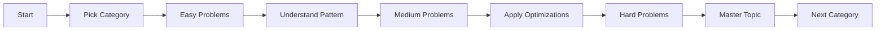

<div align="center">

# 🎯 Algorithmic Problem Solving Repository

### *A Comprehensive Collection of Interview-Ready Solutions*

[](https://github.com/Muhammed-Maklad/Problem-Solving)
[](https://opensource.org/licenses/MIT)
[](http://makeapullrequest.com)

**Master data structures and algorithms through curated, well-documented solutions**

[Explore Problems](#table-of-contents) • [Get Started](#️-problem-categories) • [Contribute](#-contributing) • [Contact](#stay-connected)

</div>

---

## Table of Contents

- [Overview](#-overview)
- [Key Features](#-key-features)
- [Repository Metrics](#-repository-metrics)
- [Problem Categories](#️-problem-categories)
   - [Python](#️-problem-categories)
      - [Array](#-array-problems)
      - [String](#-string-problems)
      - [Dynamic Programming](#-dynamic-programming)
   - [SQL](#️-sql-problems)
- [Getting Started](#-getting-started)
- [Usage Guide](#installation)
- [Contributing](#contributing)
- [Support & Community](#-support--community)
- [License](#-license)

---

## 🌟 Overview

This repository is a **production-ready resource** for software engineers preparing for technical interviews and developers seeking to strengthen their algorithmic problem-solving skills. Each solution is crafted with the same rigor expected in professional software development.


### ✨ Key Features

<table>
<tr>
<td width="50%">

### 📚 **Structured Learning**
- Organized by data structure and algorithm type
- Progressive difficulty levels (Easy → Medium → Hard)
- Topic-based categorization for focused practice

</td>
<td width="50%">

### 💡 **Detailed Solutions**
- Clear problem statements with constraints
- Multiple solution approaches where applicable
- Comprehensive time/space complexity analysis

</td>
</tr>
<tr>
<td width="50%">

### 🎓 **Interview Ready**
- Common patterns from technical interviews
- Edge cases and gotchas highlighted
- Best practices and optimization techniques

</td>
<td width="50%">

### 🔄 **Active Maintenance**
- Regular updates with new problems
- Community contributions welcomed
- Continuous improvement of existing solutions

</td>
</tr>
</table>
<hr>


## 📊 Repository Metrics

<div align="center">

### Problem Distribution


### Overall Statistics


</div>

<div align="center">

| Category | Count | Difficulty Range |
|----------|-------|------------------|
| **String Manipulation** | 8 | Easy - Medium |
| **Array Algorithms** | 9 | Easy - Hard |
| **SQL Queries** | 15 | Easy - Hard |
| **Total** | **32** | **All Levels** |

</div>


---

## 🗂️ Problem Categories

### 🔤 String Problems

<details open>
<summary><b>View All String Problems (8)</b></summary>

| # | Problem | Difficulty | ID | Key Concepts |
|---|---------|------------|----|--------------| 
| 1 | [Rotate String](./String/Rotate%20String/README.md) |  | 796 | String Manipulation |
| 2 | [String to Integer (atoi)](./String/String%20to%20Integer%20(atoi)/README.md) |  | 8 | String Parsing, Edge Cases |
| 3 | [Multiply Strings](./String/Multiply%20Strings/README.md) |  | 43 | Math, Simulation |
| 4 | [Letter Combinations of a Phone Number](./String/Letter%20Combinations%20of%20a%20Phone%20Number/READme.md) |  | 17 | Backtracking, Recursion |
| 5 | [Score of a String](./String/Score%20of%20a%20String/READme.md) |  | 3110 | ASCII Operations |
| 6 | [Excel Sheet Column Title](./Excel%20Sheet%20Column%20Title/EWADME.md) |  | 168 | Math, Base Conversion |
| 7 | [Find Words Containing Character](./String/Find%20Words%20Containing%20Character/Readme.md) |  | 2942 | Array, String Search |
| 8 | [Find Smallest Letter Greater Than Target](./String/744.%20Find%20Smallest%20Letter%20Greater%20Than%20Target/ReadME.md) |  | 744 | Binary Search |
|9| [Maximum Substrings With Distinct Start](./String/Maximum%20Substrings%20With%20Distinct%20Start/Readme.md) |  | 3760 | distinct characters |


</details>

### 📊 Array Problems

<details open>
<summary><b>View All Array Problems (9)</b></summary>

| # | Problem | Difficulty | ID | Key Concepts |
|---|---------|------------|----|--------------| 
| 1 | [Remove Element](./Array/Remove%20Element/READme.md) |  | 27 | Two Pointers, In-place |
| 2 | [Median of Two Sorted Arrays](./Array/4.%20Median%20of%20Two%20Sorted%20Arrays/Readme.md) |  | 4 | Binary Search, Divide & Conquer |
| 3 | [Single Number](./Array/Single%20Number/Readme.md) |  | 136 | Bit Manipulation, XOR |
| 4 | [Summary Ranges](./Array/228.%20Summary%20Ranges/Summary%20Ranges.md) |  | 228 | Array Traversal |
| 5 | [Merge Intervals](./Array/56.%20Merge%20Intervals/Readme.md) |  | 56 | Sorting, Intervals |
| 6 | [Group Anagrams](./String/49.%20Group%20Anagrams/Readme.md) |  | 49 | Hash Table, Sorting |
| 7 | [Product of Array Except Self](./Array/238.%20Product%20of%20Array%20Except%20Self/Readme.MD) |  | 238 | Prefix Sum, Space Optimization |

</details>

### 🗄️ SQL Problems

<details open>
<summary><b>View All SQL Problems (15)</b></summary>

| # | Problem | Difficulty | ID | Key Concepts |
|---|---------|------------|----|--------------| 
| 1 | [Employees Earning More Than Their Managers](./SQL/181.%20Employees%20Earning%20More%20Than%20Their%20Managers/ReadME.md) |  | 181 | Self Join |
| 2 | [Delete Duplicate Emails](./SQL/196%20%20Delete%20Duplicate%20Emails/READMe.md) |  | 196 | DELETE, Self Join |
| 3 | [Investments in 2016](./SQL/585.%20Investments%20in%202016/READMe.MD) |  | 585 | Window Functions, Aggregation |
| 4 | [Friend Requests II: Who Has the Most Friends](./SQL/602.Who%20Has%20the%20Most%20Friends/Readme.MD) |  | 602 | UNION, GROUP BY |
| 5 | [Consecutive Numbers](./SQL/180.%20Consecutive%20Numbers/ReadMe.md) |  | 180 | Window Functions, LAG/LEAD |
| 6 | [User Activity for the Past 30 Days I](./SQL/User_Activity_LAST_30_DAY/Readme.md) |  | 1141 | Date Functions, Filtering |
| 7 | [Rank Scores](./SQL/178.%20Rank%20Scores/README.md) |  | 178 | DENSE_RANK, Window Functions |
| 8 | [Department Top Three Salaries](./SQL/185.%20Department%20Top%20Three%20Salaries/Readme.MD) |  | 185 | Window Functions, CTE |
| 9 | [Find Loyal Customers](./SQL/3657.%20Find%20Loyal%20Customers/README.md) |  | 3657 | Aggregation, HAVING |
| 10 | [Nth Highest Salary](./SQL/177.%20Nth%20Highest%20Salary/Readme.MD) |  | 177 | Function Creation, DENSE_RANK |
| 11 | [Trips and Users](./SQL/262.%20Trips%20and%20Users/Readme.md) |  | 262 | Complex Joins, CASE |
| 12 | [Department Highest Salary](./SQL/184.%20Department%20Highest%20Salary/Readme.md) |  | 184 | Subqueries, DENSE_RANK |
| 13 | [Tree Node](./SQL/608.%20Tree%20Node/Readme.MD) |  | 608 | CASE, Hierarchical Data |
| 14 | [Managers with at Least 5 Direct Reports](./SQL/570.%20Managers%20with%20at%20Least%205%20Direct%20Reports/Readme.MD) |  | 570 | Subqueries, Aggregation | 
| 15 | [Triangle Judgement](./SQL/610.%20Triangle%20Judgement/README.MD) |  | 610 | CASE |


</details>


### 💥 Dynamic Programming 

<details open>
<summary><b>View All Dynamic Programming Problems (1)</b></summary>

| # | Problem | Difficulty | ID | Key Concepts |
|---|---------|------------|----|--------------| 
| 1 | [Climbing Stairs](./Dynamic%20Programming/70.%20Climbing%20Stairs/Readme.MD) |  | 70 | Math , DP , Memoization |

</details>

---


## 🚀 Getting Started

### Prerequisites

Ensure you have the following installed on your system:

```bash
# Programming Languages
- Python 3.8+ (for algorithmic problems)
- SQL (MySQL 8.0+ or PostgreSQL 12+)

# Development Tools
- Git
- Code Editor (VS Code, PyCharm, or similar)
- Terminal/Command Line Interface
```

### Installation

1. **Clone the repository**
   ```bash
   git clone https://github.com/Muhammed-Maklad/Problem-Solving.git
   cd Problem-Solving
   ```

2. **Verify the structure**
   ```bash
   ls -la
   # You should see: Array/, String/, SQL/, README.md, LICENSE
   ```

3. **Navigate to a problem**
   ```bash
   cd "String/Rotate String"
   cat README.md
   ```

### Quick Start Example

```bash
# 1. Choose a category
cd Array

# 2. Select a problem
cd "Single Number"

# 3. Read the problem
cat README.md

# 4. View the solution
cat solution.py

# 5. Run tests (if available)
python solution.py
```


### Recommended Learning Path



### Study Approach

1. **Read & Understand**: Carefully read the problem statement and constraints
2. **Plan**: Think through the approach before coding (5-10 minutes)
3. **Implement**: Write clean, commented code
4. **Test**: Verify with provided test cases and edge cases
5. **Analyze**: Review time/space complexity
6. **Optimize**: Consider alternative approaches
7. **Review**: Compare with the provided solution

### Problem Template Structure


## 🤝 Contributing

We welcome contributions from the community! Your contributions help make this resource better for everyone.

### How to Contribute

<details>
<summary><b>Step-by-Step Contribution Guide</b></summary>

#### 1. Fork & Clone
```bash
# Fork the repository on GitHub, then:
git clone https://github.com/YOUR_USERNAME/Problem-Solving.git
cd Problem-Solving
```

#### 2. Create a Branch
```bash
git checkout -b feature/add-problem-name
```

#### 3. Add Your Solution

Create a new folder following this structure:
```
Category/Problem-Name/
├── README.md
└── solution.py
```

**README.md Template:**
```markdown
# Problem Name

**Difficulty:** Easy/Medium/Hard  
**Problem ID:** [LeetCode/HackerRank ID]  
**Topics:** [Array, String, etc.]

## Problem Statement
[Clear description of the problem]

## Constraints
- [List all constraints]

## Examples
### Example 1:
Input: [input]
Output: [output]
Explanation: [explanation]

## Approach
[Detailed explanation of the solution approach]

## Complexity Analysis
- **Time Complexity:** O(?)
- **Space Complexity:** O(?)

## Solution
[Link to solution file or code block]
```

#### 4. Update Main README
Add your problem to the appropriate table in the main README.md

#### 5. Commit & Push
```bash
git add .
git commit -m "Add solution for [Problem Name]"
git push origin feature/add-problem-name
```

#### 6. Create Pull Request
Open a PR on GitHub with a clear description of your changes

</details>

### Contribution Guidelines

- ✅ Follow the existing folder structure and naming conventions
- ✅ Include comprehensive README with problem statement and explanation
- ✅ Write clean, well-commented code
- ✅ Test your solution with multiple test cases
- ✅ Include time and space complexity analysis
- ✅ Use meaningful variable names
- ✅ Follow PEP 8 (Python) or relevant style guides

### Areas for Contribution

- 🆕 Add new problem solutions
- 📝 Improve existing documentation
- 🐛 Fix bugs or errors in solutions
- 🎨 Enhance code quality and readability
- 🌐 Add solutions in additional languages (Java, C++, JavaScript)
- ✅ Add unit tests for existing solutions
- 📊 Create visualization or interactive tutorials

---

## 💬 Support & Community

### Get Help

- 🐛 **Found a Bug?** [Open an Issue](https://github.com/Muhammed-Maklad/Problem-Solving/issues)
- 💡 **Have a Suggestion?** [Start a Discussion](https://github.com/Muhammed-Maklad/Problem-Solving/discussions)
- ❓ **Need Help?** Check existing issues or create a new one

### Stay Connected

<div align="center">

[](https://github.com/Muhammed-Maklad)
[](https://www.linkedin.com/in/muhammed-maklad/)
[](mailto:mo7amedmaklad@gmail.com)

</div>

### Show Your Support

If you find this repository helpful, please consider:

<table>
<tr>
<td align="center" width="33%">
⭐ <b>Star the Repo</b><br>
Help others discover it
</td>
<td align="center" width="33%">
🔀 <b>Contribute</b><br>
Add your solutions
</td>
<td align="center" width="33%">
📢 <b>Share</b><br>
Spread the word
</td>
</tr>
</table>

---

## 📄 License

**Full license:** [LICENSE](LICENSE)


---

<div align="center">

### 🌟 **Thank You for Visiting!** 🌟

*"The only way to learn a new programming language is by writing programs in it."* - Dennis Ritchie

**Keep coding, keep learning, keep growing** 🚀

---

**Made with ❤️ by [Muhammed Maklad](https://github.com/Muhammed-Maklad)**

[](https://github.com/Muhammed-Maklad)
[](https://github.com/Muhammed-Maklad/Problem-Solving)

</div>