# Problem Solving Repository

## Description
This repository contains solutions to various algorithmic problems categorized by type. Each problem is accompanied by a detailed README file explaining the problem statement, constraints, examples, and solution approach.

---

## Statistics

  <h3>📊 Repository Statistics 📊</h3>
  
  
<a href="./statistics_dashboard.html"><b>➡️ Open Interactive Dashboard for Real-time Updates ⬅️</b></a>

---

## Index

### String Problems
| Problem Name                | Difficulty | Problem ID |
|-----------------------------|------------|------------|
| [Rotate String](./String/Rotate%20String/README.md) | Easy       | 796        |
| [String to Integer (atoi)](./String%20to%20Integer%20(atoi)/README.md) | Medium     | 8          |
| [Multiply Strings](./Multiply%20Strings/README.md) | Medium     | 43         |

### Array Problems
| Problem Name                | Difficulty | Problem ID |
|-----------------------------|------------|------------|
| [Remove Element](./Remove%20Element.py) | Easy       | 27         |

---

## Notes
This repository is designed to help improve problem-solving skills and prepare for coding interviews. Each problem is categorized for easy navigation and understanding.