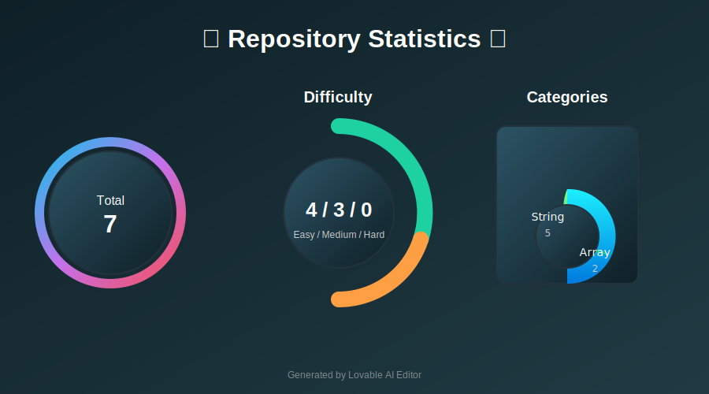

# Problem Solving Repository

## Description
This repository contains solutions to various algorithmic problems categorized by type. Each problem is accompanied by a detailed README file explaining the problem statement, constraints, examples, and solution approach.

---

## Statistics

  <h3>📊 Repository Statistics 📊</h3>
  

---

## Index

### String Problems
| Problem Name                | Difficulty | Problem ID |
|-----------------------------|------------|------------|
| [Rotate String](./String/Rotate%20String/README.md) | Easy       | 796        |
| [String to Integer (atoi)](./String%20to%20Integer%20(atoi)/README.md) | Medium     | 8          |
| [Multiply Strings](./Multiply%20Strings/README.md) | Medium     | 43         |
| [Letter Combinations of a Phone Number](./Letter%20Combinations%20of%20a%20Phone%20Number/READme.md) | Medium     | 17         |
| [Score of a String](./Score%20of%20a%20String/READme.md) | Easy | 3110 |
| [Excel Sheet Column Title](./Excel%20Sheet%20Column%20Title/EWADME.md) | Easy | 168 |
| [Find Words Containing Character](./Find%20Words%20Containing%20Character/READme.md) | Easy | 2942 |

### Array Problems
| Problem Name                | Difficulty | Problem ID |
|-----------------------------|------------|------------|
| [Remove Element](./Remove%20Element/READme.md) | Easy       | 27         |
| [Median of Two Sorted Arrays](./Median%20of%20Two%20Sorted%20Arrays/READme.md) | Hard       | 4          |
| [Single Number](./Single%20Number/READme.md) | Easy | 136 |

---

## Notes
This repository is designed to help improve problem-solving skills and prepare for coding interviews. Each problem is categorized for easy navigation and understanding.