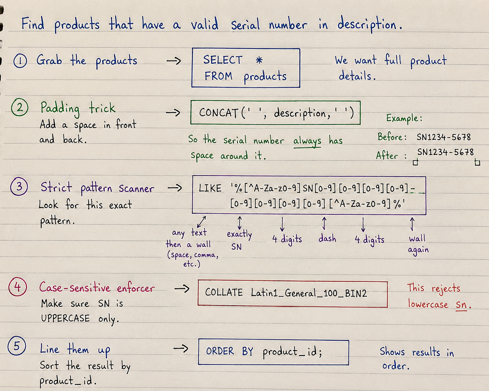

# 🚀 Simple Solution Step By Step With 100% Beat Submissions (I am Sure you will understand it)



### 🚀 The 1-Line Logical Steps

**1️⃣ Grab the Products:** We want to show the full product details, so we simply select everything.

```sql
SELECT *
FROM products

```

**2️⃣ The Padding Trick:** We glue a blank space to the front and back of the text. This guarantees our serial number will always have "room to breathe" on both sides, even if it's the very first or very last word in the sentence!

```sql
WHERE CONCAT(' ', description, ' ')

```

**3️⃣ The Strict Pattern Scanner:** Let's break down the sketch:

* `%` means "any random text."
* `[^A-Za-z0-9]` is a "wall" (like a space or comma) so the serial isn't glued to another word.
* `SN` is exactly the letters SN.
* `[0-9][0-9][0-9][0-9]` is exactly 4 digits.
* `-` is a dash.
* Then 4 more digits, and a final "wall" at the end so we don't accidentally accept 5-digit numbers!

```sql
      LIKE '%[^A-Za-z0-9]SN[0-9][0-9][0-9][0-9]-[0-9][0-9][0-9][0-9][^A-Za-z0-9]%'  

```

**4️⃣ The Case-Sensitive Enforcer:** SQL usually ignores capital letters by default. The `COLLATE` command forces the database to only accept uppercase `SN` and completely reject lowercase `sn`.

```sql
      COLLATE Latin1_General_100_BIN2

```

**5️⃣ Line Them Up:** Sort the final list of valid products chronologically by their ID number.

```sql
ORDER BY product_id;

```

---

## 💻 The Final Assembled Code

```sql
/* Write your T-SQL query statement below */
SELECT *
FROM products
WHERE CONCAT(' ', description, ' ')
      LIKE '%[^A-Za-z0-9]SN[0-9][0-9][0-9][0-9]-[0-9][0-9][0-9][0-9][^A-Za-z0-9]%'  
      COLLATE Latin1_General_100_BIN2
ORDER BY product_id;

```

---

## ⚡ Complexity

* ⏳ **Time Complexity:** O(N * M) — Where N is the number of rows and M is the average length of the description. The database must scan every single character to check if the sketch matches.
* 💾 **Space Complexity:** O(N) — The `CONCAT` function creates a temporary padded version of the description string in memory for the database to scan.
